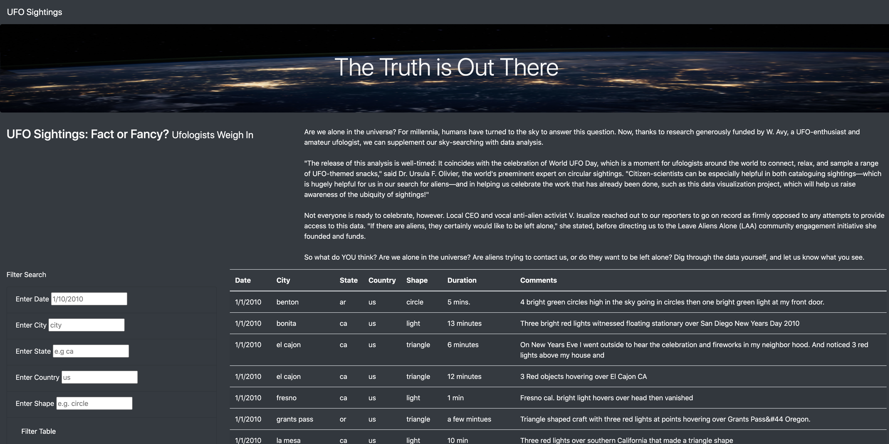

# UFOs

## Goal:
- create advanced filtering capability for the webpage, it will allow users to filter the data by multiple factors.
- filters in the table:
Date
City
State
Country
Shape

- the end result of this project will be an HTML page.

## Technologies used:
JavaScript
- to build a table using data stored in a JavaScript array
Bootstrap 
- The Bootstrap grid system to help organize a webpage’s content into containers, rows, and columns.
CSS
- CSS to add customizations to Web page, it will take place in the style.css file

## Steps taken:
- generate the table with JavaScript
- import the data
- display data in a table referencing the 'tbody' HTML tag using D3
 (D3 is a JavaScript library that produces sophisticated and highly dynamic graphics in an HTML webpage.)
- clear the data (create a blank canvas)
- loop through each object in the data and append a row and cells for each value in the row
- loop Through  Each field in Data Rows
- grab the values from the filters:
- filter the data using the filters
- rebuild the table using the filtered data
- attach an event to listen for the form button (D3)
- build the table when the page loads

## Recommendation:
- map with the location of the sightings
- frequency of the sightings
- add filter with the duration of the sighting

